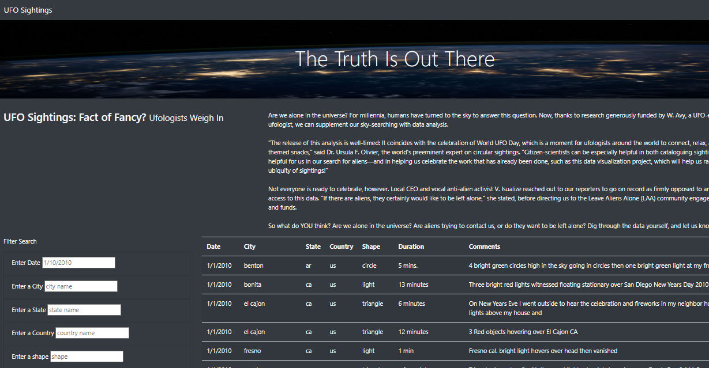
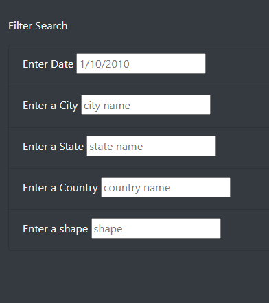
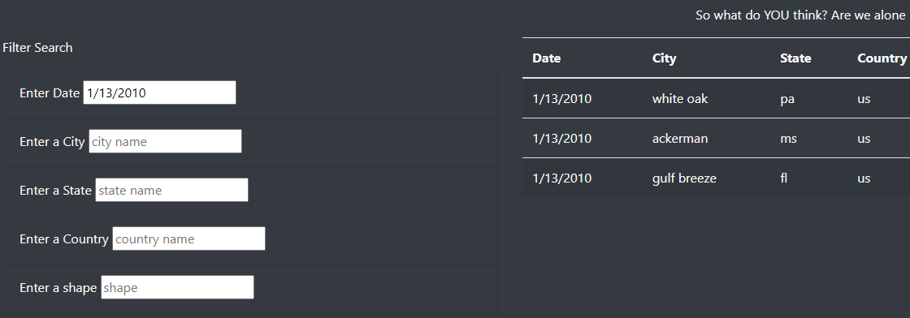
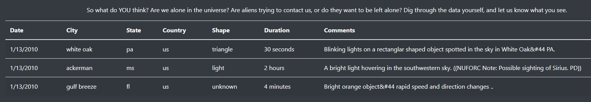

# UFOs

## Overview
We were tasked with creating a website that allowed a user to filter through a set of data results for UFO sightings. The goal was to be able to quickly search for information via specific keywords like Date, City, Time, etc.

As we can see below there are several filters provided to search through the data.

## Results
Filtering through the data is quite simple. First fill in the fields with the data that is to be searched on as shown in the example below.

Once the enter key is pressed the filters will be applied to return anything in those paramters:

## Summary

While this provides a simple way of filtering through the dataset provided there are some drawbacks and limitation. First, one must know and enter the entire date in order to return data for that date (ie: 01/01/2010 as opposed to 01/2010). Adding variables that allow to search over a month range would be one improvement to the search functionality. Another possible improvement to the filtering process would be to create a drop down list of data (dates or cities for example) that would allow the user to input queries on the data provided as opposed to needing to know what dates or cities are actually in the data set in order to search.